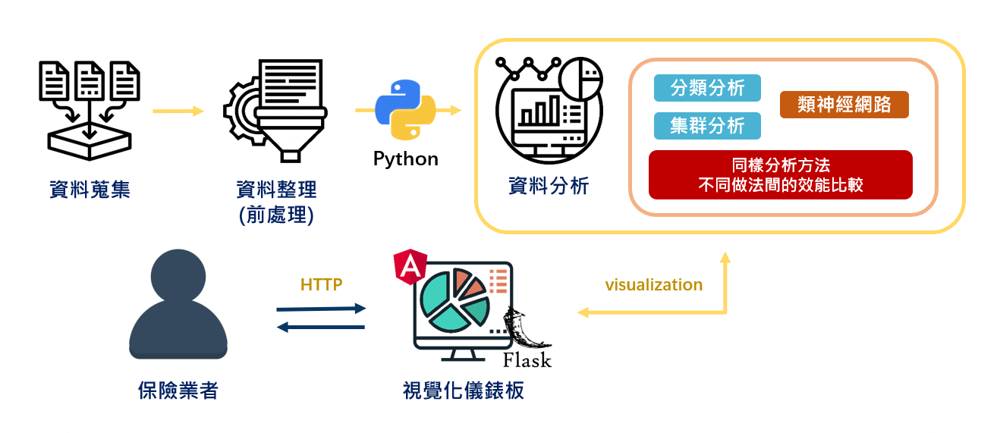
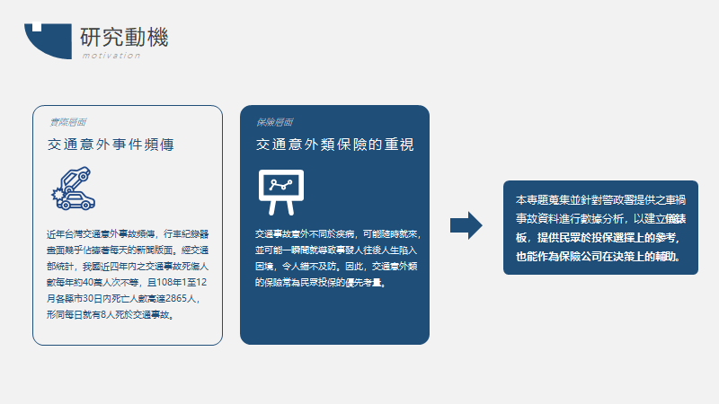

# 全台交通意外事件分析 - 以保險業為觀點 (Accident Analysis)

詳細內容可查閱<a href="static/data/人工智慧期末專題 - 全台交通意外事件分析(以保險業為觀點) - 成果展示.pdf" download>介紹文件</a>

## 啟動網站
    cd your_project

    # run server on localhost:8090:
    python app.py

網站將啟動在localhost:8090

## 研究動機

## 開發方法

## 相關技術

## 開發成果
風險評估儀錶板

分析方法比較

查看原始資料
